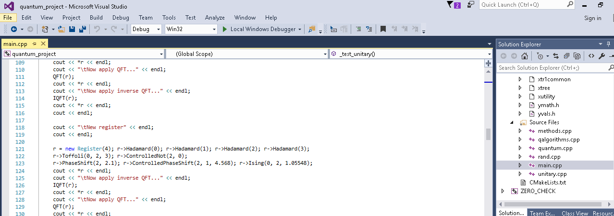

# Design Framework
## Cmake:
Là một trong những công cụ khá quen thuộc và phổ biến cho những LTV thiết bị nhúng. Có chức năng là sinh ra Makefile hiệu quả. 

Ứng dụng này có mục đích làm giảm dung lượng các file chia sẻ trên mạng bằng cách tạo ra các file config cần thiết cho project, khi đó người chia sẻ source và người sử dụng chỉ cần chia sẻ những file code. Cmake hỗ trợ rất nhiều project của nhiều ngôn ngữ khác nhau, nhiều phiên bản của các IDE nổi tiếng và nhiều option để người dùng lựa chọn.

Lấy 1 thí dụ về project C++ chạy bằng Visual studio: Project cần các file như ***.sln, *.vcxproj, vcxproj.filters,… chứa thông tin về project, như là project đó cần compile những file nào, solution có bao nhiêu project, project build trên platform nào,…** thì Cmake sẽ tạo ra các file đó giùm bạn.

Còn nếu không có Cmake thì sao? Người chia sẻ file sẽ phải tạo ra các file config ứng với mỗi phiên bản IDE, chỉ riêng Visual Studio đã có nhiều phiên bản: VS 2008, VS 2010, VS 2012, VS 2013, VS 2015, VS 2017. Cộng thêm các ngôn ngữ khác nữa thì số lượng file phải tạo ra quá nhiều. Làm cho dung lượng file chia sẻ tăng lên đáng kể.

Cmake thuận tiện cho tất cả các framework trong C/C++ 

+ Cài đặt Cmake trên Windows: Tải và cài đặt [ở đây](https://cmake.org/download/)
+ Cài đặt Cmake trên Linux: 

  ```
  wget https://cmake.org/files/v3.12/cmake-3.12.0.tar.gz
  tar xzf cmake-3.12.0.tar.gz
  cd cmake-3.12.0
  ./configure --help
  ./configure --prefix=/opt/cmake
  make 
  make install 
  ```

  **Verify installed:** `/opt/cmake/bin/cmake -version` 

   
   
   _Một hình ảnh sau khi đã build các file cấu hình cho IDE bằng Cmake_
   
_VD0: [Hello world với C trong Cmake](./Example/VD0.md)_


_VD1: Viết chương trình mô phỏng máy tính bỏ túi với các file header (sum.h, sub.h, multiple.h, divide.h)_

_VD2: Ứng dụng quản lý sinh viên với việc sử dụng các file header **(sort.h, search_student.h, update_info.h)** với việc build static library và dynamic library_

_VD4: Opencv với Cmake_

- Step 1: Download [OpenCV](https://github.com/opencv/opencv) and [Cmake](https://cmake.org/)
- Step 2: Build opencv with cmake
  
  
  
  + Press **configure**, choose **visual studio 2015**, finish
  + Then press **generate**
- Step 3:
  
  Open **OpenCV.sln** under **build/**
- Step 4: Build it using **Debug, Release**

  
  
  * Right **click > build**
  * Switch to **Release** mode and build again
- Setting up **environment variable**
  - add `<opencv>/bin into PATH` 
  
  
  
  - Add new environment named **OpenCV_DIR**, value as `<opencv>/build`
  - It may need logout to apply setting, you can check it by **echo %PATH%, echo %OpenCV_DIR%**


